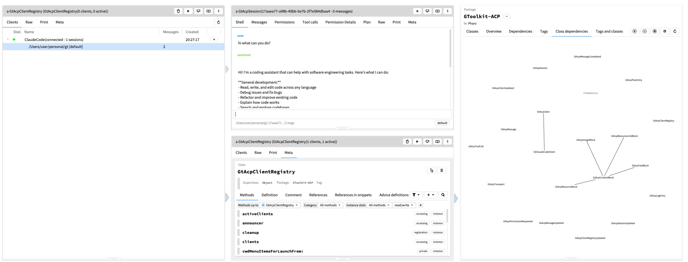

# gtoolkit-acp

A [Glamorous Toolkit](https://gtoolkit.com/) client for the [Agent Client Protocol(ACP)](https://agentclientprotocol.com/get-started/introduction). The Agent Client Protocol (ACP) standardizes communication between code editors/IDEs like GT.

This package lets you launch Claude Code agent processes from within GT, send prompts, stream responses, manage sessions, handle tool-call permissions, and inspect every detail of the conversation through GT's inspector views.



## Features

- **Multi-session management** -- launch one or more Claude Code processes, each with independent sessions in different working directories.
- **Interactive shell view** -- a chat-style UI embedded in the GT inspector for sending prompts and viewing streamed responses (text, thinking, tool calls).
- **Permission handling** -- tool-call permission requests appear inline with Allow / Allow Always / Reject buttons. Tools marked "always allow" are auto-approved for the remainder of the session.
- **Full message inspection** -- every message, content block, tool call (with raw input/output), and thinking trace is a first-class GT object you can inspect.
- **Plan tracking** -- plan entries from the agent are displayed with status indicators.
- **Traffic log** -- the raw JSON-RPC traffic between GT and the Claude Code process is recorded and browsable.
- **GT Home integration** -- an "Agents" card on the GT Home screen opens the client registry.
- **File browser integration** -- any directory in the GT file browser gets a play button to launch a Claude Code session rooted there.

## Prerequisites

1. **Glamorous Toolkit** (v1.0+)
2. **Node.js** (v18+)
3. **Claude Code ACP server** (`claude-code-acp`) -- the Node.js process that speaks ACP over stdio. See the [Claude Code ACP docs](https://github.com/zed-industries/claude-agent-acp) for setup.

## Installation

Load via Metacello:

```smalltalk
Metacello new
    baseline: 'GtoolkitAcp';
    repository: 'github://dweinstein/gtoolkit-acp:main/src';
    load.
```

The baseline loads three packages:

| Package | Contents |
|---|---|
| `GToolkit-ACP` | Core model: transport, client, session, messages, tool calls, content blocks |
| `GToolkit-ACP-UI` | Inspector views and interactive shell element |
| `GToolkit-ACP-Examples` | `gtExample` methods for the transport layer |

## Configuration

Before launching, configure `GtClaudeCodeClient` with the paths to your Node.js binary and the ACP server entry point:

```smalltalk
GtClaudeCodeClient programPath: '/path/to/node'.
GtClaudeCodeClient programArgs: #('/path/to/claude-code-acp/dist/index.js').
GtClaudeCodeClient defaultCwd: '/path/to/your/project'.
```

## Usage

### Quick launch

```smalltalk
"Launch a client with a session in the default working directory"
client := GtClaudeCodeClient launch.
```

Or launch in a specific directory:

```smalltalk
client := GtClaudeCodeClient launchIn: '/path/to/project'.
```

The returned `GtClaudeCodeClient` is immediately inspectable. Open the **Sessions** view, then click into a session and switch to its **Shell** view for an interactive chat.

### Sending prompts programmatically

```smalltalk
client := GtClaudeCodeClient new.
client connect.
client initializeDo: [ :result |
    client newSessionIn: '/tmp' do: [ :session |
        client
            prompt: 'What files are in this directory?'
            inSession: session
            do: [ :result | "response complete" ]
            onError: [ :err | Transcript crShow: err printString ] ]
    onError: [ :err | Transcript crShow: err printString ] ]
onError: [ :err | Transcript crShow: err printString ].
```

### Managing permissions

When Claude Code requests permission to run a tool, the session's shell UI shows buttons for each option. You can also respond programmatically:

```smalltalk
"Allow once"
client allowPermission: requestId.

"Allow always (for this session)"
client allowAlwaysPermission: requestId.

"Reject"
client rejectPermission: requestId.
```

### Client registry

All clients register themselves in `GtAcpClientRegistry uniqueInstance`. You can browse it from the GT Home "Agents" card or directly:

```smalltalk
GtAcpClientRegistry uniqueInstance.
```

### Inspector views

Inspecting the core objects reveals rich GT views:

| Object | Key views |
|---|---|
| `GtAcpClientRegistry` | Clients tree (with status, sessions, quick-launch actions) |
| `GtAcpClient` | Sessions list, traffic log, disconnect/new-session actions |
| `GtAcpSession` | Shell (interactive chat), Messages, Tool calls, Plan, Permissions |
| `GtAcpMessage` | Content items, full text, thinking trace |
| `GtAcpToolCall` | Details (title, status, raw input/output) |
| `GtAcpTransport` | Status, message log |

## Architecture

```
GtAcpClientRegistry (singleton)
 └── GtAcpClient / GtClaudeCodeClient
      ├── GtAcpTransport  (JSON-RPC over stdio)
      └── GtAcpSession(s)
           ├── GtAcpMessage(s)
           │    ├── GtAcpTextBlock
           │    ├── GtAcpImageBlock
           │    ├── GtAcpResourceBlock / GtAcpResourceLinkBlock
           │    └── GtAcpToolCall(s)
           └── GtAcpPlanEntry(s)
```

- **`GtAcpTransport`** spawns an external process, frames newline-delimited JSON-RPC messages over stdin/stdout, and dispatches responses and server-initiated methods to registered handlers.
- **`GtAcpClient`** orchestrates the protocol lifecycle (`initialize`, `session/new`, `session/prompt`, `session/cancel`, `session/set_mode`) and routes `session/update` and `session/request_permission` messages to the appropriate session.
- **`GtAcpSession`** accumulates messages, tool calls, plan entries, and permission history as updates stream in.

